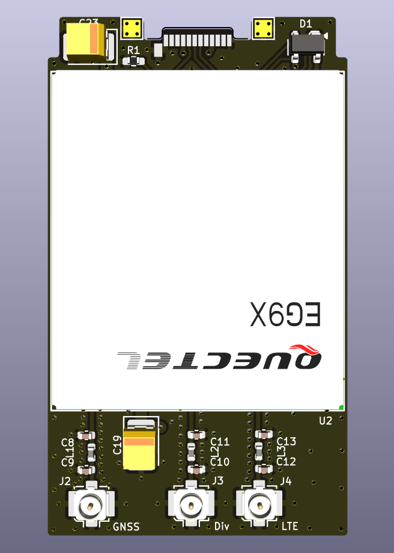
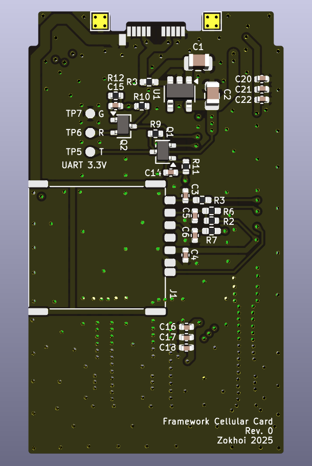

## Framework Cellular Expansion Card

Compatible with Quectel cellular modules with same pinout as BG96.

This PCB design has never been tested nor guarenteed to work as of current, therefore gerber will not be provided and you should only proceed ordering at your own risk.

This PCB design does not incorporate built in antennas, and instead includes MHF-1 connectors for LTE main, diversity and GNSS. Thus you should pair your own 50 ohms impedance LTE antenna.

The PCB is 15mm longer than a regular expansion card PCB, a case design is in the works.

### Board specifications

Size 26mm x 45mm, thickness 0.8mm, 4 layers, copper thickness 1oz 0.5oz 0.5oz 1oz, impedance controlled board with 0.2mm prepeg

### Compatible modem series comparison

| Modem series | Cellular standards | Downlink speed | Uplink speed | Cost |
|--------------|--------------------|----------------|--------------|------|
| EG95         | 4G, 3G, 2G         | 150 Mb/s       |  50 Mb/s     | $$   |
| EG91         | 4G, 2G             |  10 Mb/s       |   5 Mb/s     | $    |
| BG96         | Cat-M, Cat-NB1     | 375 Kb/s       | 375 Kb/s     | $$   |

### License
This hardware design is licensed under [CERN-OHL-W V2 or later](License.txt).

### Board preview

